# Come contribuire a questo sito

Il sito **rokers.io** nasce per creare una community, e in quanto community, siamo
aperti ad una gestione comunitaria del nostro sito (e blog).

Per questo motivo, abbiamo scelto come piattaforma di hosting del sito GitHub, in modo
che chiunque possa accedere ai sorgenti, modificarlo e creare una pull request con
il proprio contributo, che può essere sia una miglioria, sia un nuovo post.

In questa pagina, vediamo insieme come contribuire al sito!

## Creare un Fork del sito usando GitHub

Se non lo avete, aprite un account GitHub e accedete al sorgente di questo sito,
che si trova su [github.com/robotrokers/robotrokers.github.io](https://github.com/robotrokers/robotrokers.github.io).
In alto a destra, cliccate sul tasto "Fork", per generare una copia del codice sul vostro account privato.

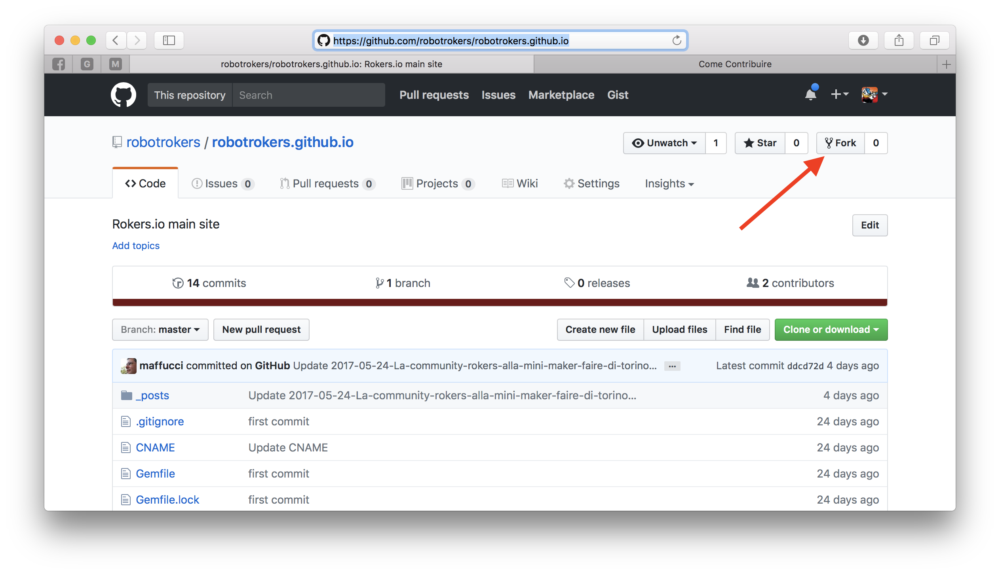
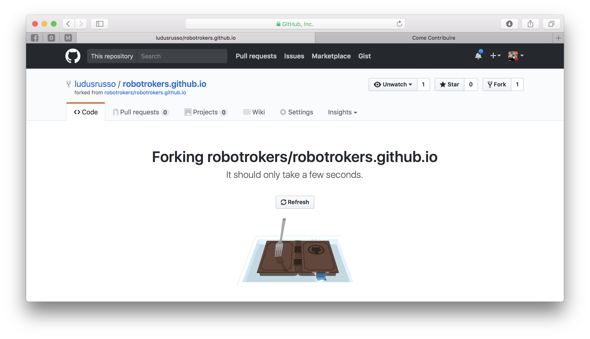

Alla fine del processo, noterete che una copia della repository è stata creata all'interno del vostro account. Ora potrete modificarlo senza problemi.

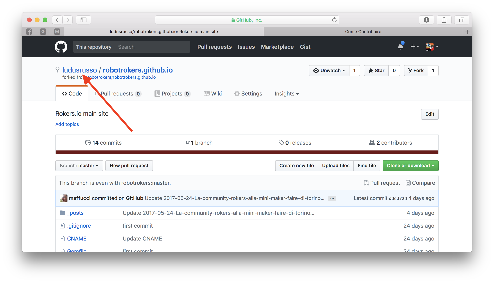

Sulla vostra copia, potrete creare una qualsiasi modifica del sito, sia aggiungendo contenuti al blog, che modificandone la struttura e apportando modifiche sostanziali. Vi mostro, a titolo di esempio, come aggiungere un post al Blog.

## Creare un nuovo post

Per creare un post, bisgona lavorare all'interno della cartella `_post` della repository, e creare un nuovo file al suo interno.

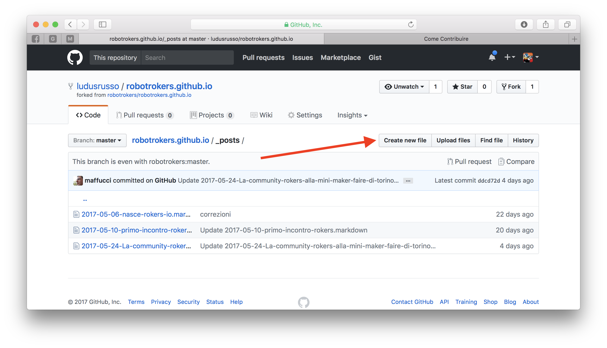

Il nome del file creato deve essere costruito nel seguente modo (altrimenti non funziona niente):
`AAAA-MM-GG-titolo-del-file.markdown`, inserendo la data attuale nel formato `AAAA-MM-GG`. Questo serve a Jekyll (il sistema che gestisce il sito) per ordinare i post in ordine cronologico.

Io sto creando un file chiamato `2017-05-30-dotbot-pi-online.markdown`.

A questo punto, dobbiamo inserire il testo del post, insieme ad alcuni metadata. Il testo va scritto in markdown, per chi non lo conoscesse, potete trovare, a [questo link](http://www.maffucci.it/2013/08/29/formattazione-del-testo-con-markdown/) una guida al suo funzionamento.


Il contenuto del file è diviso in due parti. Prima di tutto vanno inseriti alcuni metadata, mentre nella seconda parte il testo completo

```markdown
---
layout: post
title:  "Il Progetto DotBot Pi è disponibile online"
date:   2017-05-30
categories: [news, dotbot, robot]
---


# Online il progetto DotBot-Pi

DotBot Pi è un robot OpenSource sviluppato da Ludovico Russo e [HotBlack Robotics](www.hotblackrobotics.com). È il primo robot DotBot interamente
compatbile con la piattaforma HBR di Cloud Robotics e semplice da montare!


Potete trovare più informazioni al link [www.thingiverse.com/thing:2353479](https://www.thingiverse.com/thing:2353479).
```

Cliccando sul tasto **preview** potete anche vedere la preview del post.

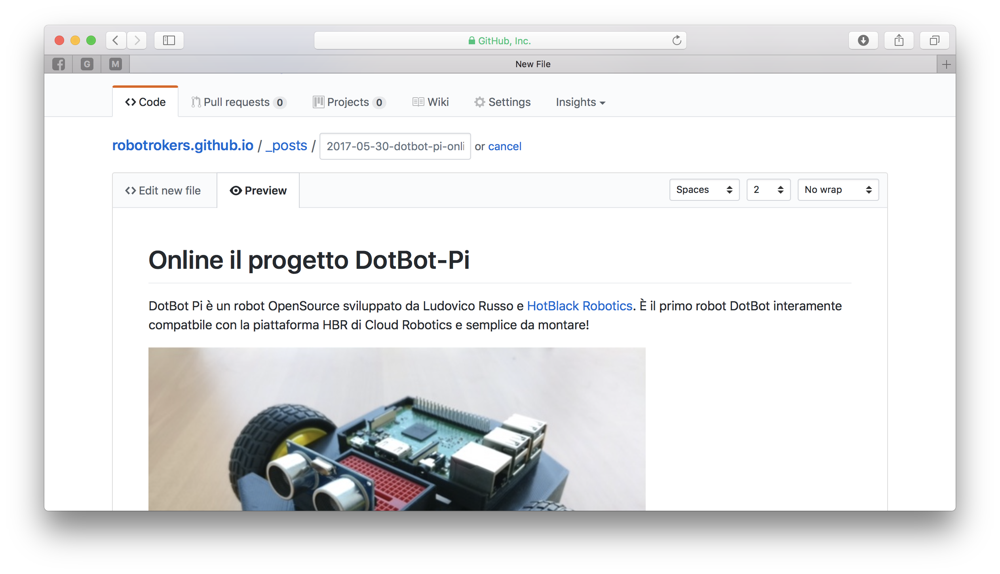


Per salvare l'articolo, premete il tasto **commit** in basso, e sarete riportati alla pagina di preview del nuovo file.

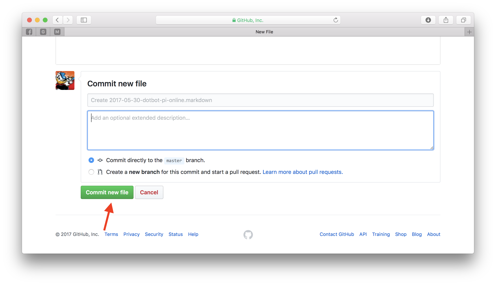


Una volta salvato, potrete comunque modificarlo cliccando sul a forma di matita.

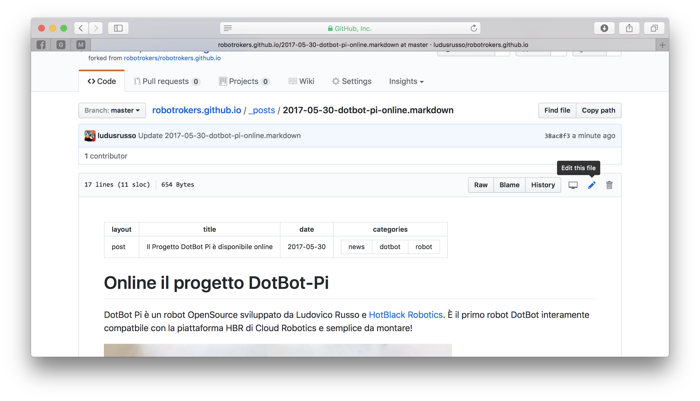

## Creare una Pull Request per apportare le modifiche sul sito originale

Ovviamente, le modifiche che apportate alla vostra copia della repository rimarranno nella vostra copia, e non sono automaticamente estese alla repository originale (e quindi non verranno mostrate nel sito). 

Per fare in modo che queste modifiche siano implementate nel sito, dovete creare una pull request verso la repository originale. 

Vediamo come fare.

Accediamo alla pagina principale della copia della repository e clicchiamo il tasto **new pull request**.


Si aprirà una pagina che chiederà di aggiungere un titolo ed un commento alla pull request.

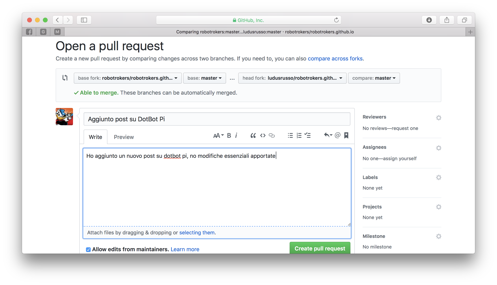

Siate chiari e concisi, non scrivete troppo (non perdete troppo tempo). A questo punto, cliccare su **Create Pull Request**.

Finalmente, la vostra pull request è pronta ed in attesa di essere approvata.
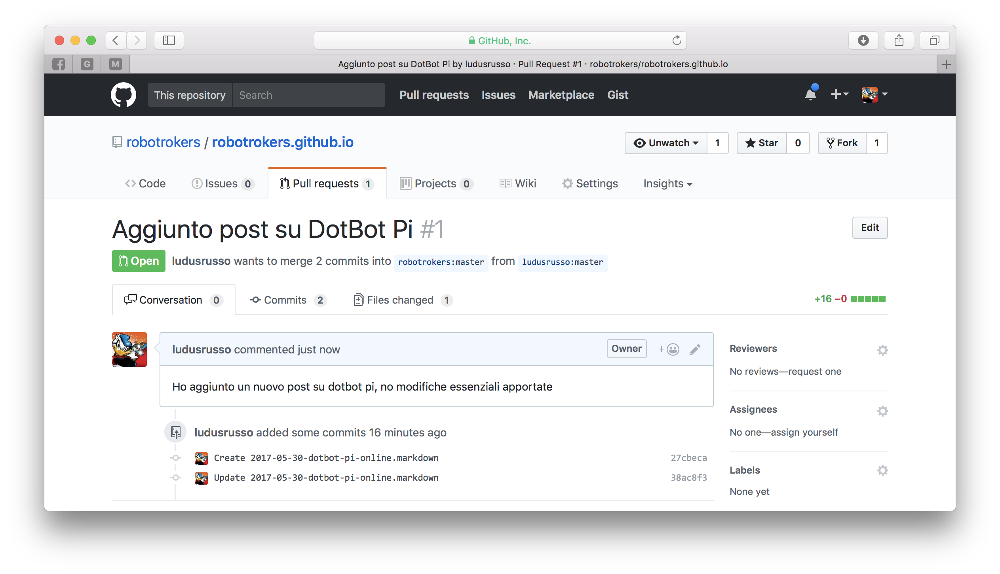

A questo punto, i mantainer del sito controlleranno che non ci siano problemi o conflitti con le modifiche e nel caso approveranno la pull request. Una volta approvata, il sito sarà modificato secondo i vostri suggerimenti.

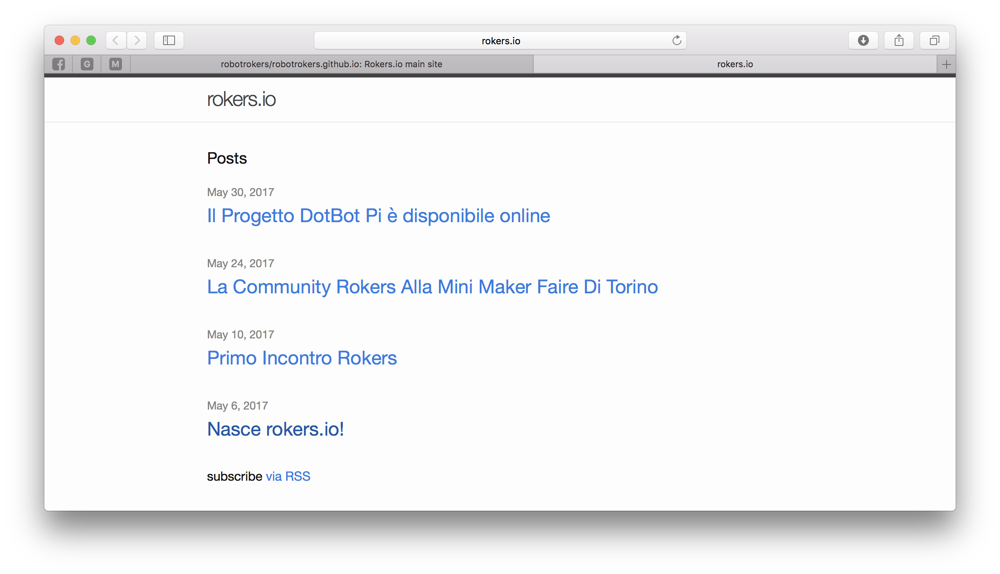
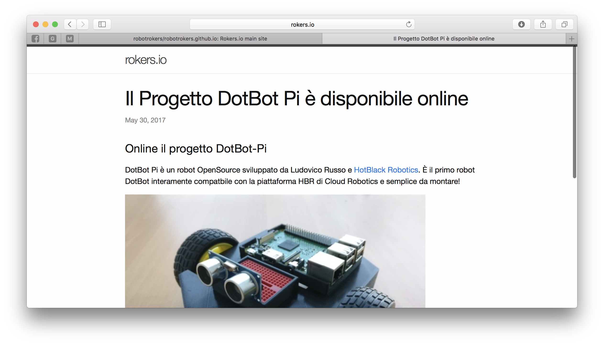